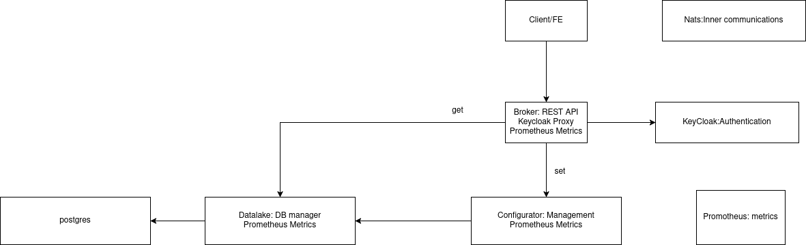

# Blanket Interview

This project is designed for the Blanket Company to manage property balances and related records.

## Prerequisites

Ensure you have the following installed on your system:

### Git
To install Git:
```bash
yum install git
```

### Docker

To install Docker:
```bash
yum install docker
```
### Docker Compose

To install Docker Compose:
```bash
mkdir -p /usr/local/lib/docker/cli-plugins/
sudo curl -SL https://github.com/docker/compose/releases/download/v2.18.1/docker-compose-linux-x86_64 -o /usr/local/lib/docker/cli-plugins/docker-compose
sudo chmod +x /usr/local/lib/docker/cli-plugins/docker-compose
```

### Getting Started

Clone the repository and navigate to the property_balance directory:
```bash
git clone https://github.com/shilogilor90work/blanket_interview.git
cd blanket_interview/property_balance
```

Start the application with Docker Compose:
```bash
docker compose up -d
```
#### Example API Calls
1. Add a property
```bash
curl -i -X POST http://localhost:80/properties -H "Content-Type: application/json" -d '{"property_id": "moshe"}'
```
2. Add an expense record
```bash
curl -i -X POST http://localhost:80/records -H "Content-Type: application/json" -d '{"property_id": "moshe", "amount": 100.50, "type": "expense"}'
```
3. Add an income record
```bash
curl -i -X POST http://localhost:80/records -H "Content-Type: application/json" -d '{"property_id": "moshe", "amount": 12.50, "type": "income"}'
```
4. Get property balance
```bash
curl -i -X GET http://localhost:80/balance/moshe -H "Content-Type: application/json"
```
5. Get monthly property balance
```bash
curl -i -X GET http://localhost:80/balance/monthly/moshe -H "Content-Type: application/json"
```
6. Get property records with filters
```bash
curl -i -X GET "http://localhost:80/records/moshe?type=expense&from=2025-01-01&to=2025-04-01&sort=desc&page=1&limit=10"
```
Project Diagram

